### Скачивание
1) Скачать файлы: git clone -b HW_7_destructions --single-branch https://github.com/etrehappy/BP_UE_Basic_Prj.git 

2) Скачать архив: [Google Диск](https://drive.google.com/drive/folders/1AT4x9XH1Nd9aMRT0jDL8yuACO0efQHsI?usp=drive_link)
    - содержит Characters (Mannequins и Mannequin_UE4) на 400 Мб

3) Извлечь содержимое в папку «BP_UE_Basic_Prj/Content» (рядом с MyContent)

### Что и как сделано 

Задание 2. UI

**Что сделано**:
 - добавлено главное меню, кнопки «Старт» и «Выход»

    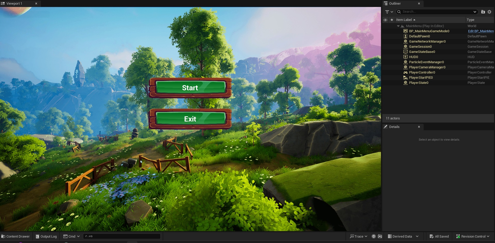
    

    
 - добавлен HP-бар.
 

    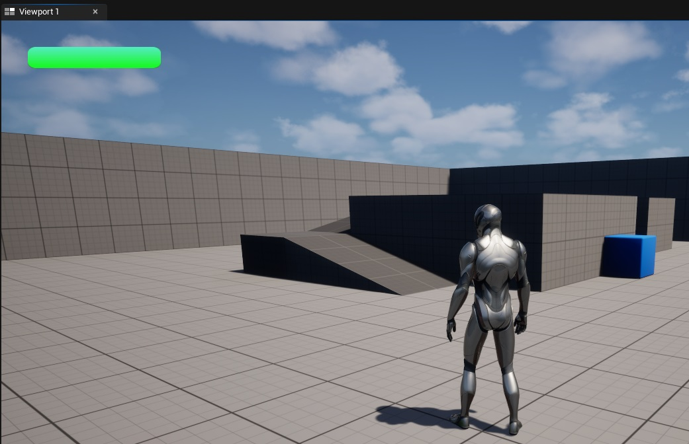

  
**Как сделано**:

1) В ./MyContent/Game/ добавлены
    - Level «MainMenu» в /Maps
    - пустой game mode «BP_MainMenuGameMode» в /Blueprints
    - Widget для кнопок "Start" и "Exit" в главном меню в /UI
    - Widget для HealthBar в /UI/UI_HealthBar
    
2) В Level «MainMenu» добавлены ноды для отображения Widget Blueprint

3) В  ./ThirdPerson/Blueprints изменен BP_ThirdPersonCharacter: 
    - добавлен HealthComponent (только прямоугольник HP)

4) Текстуры из интернета: 
    - ./MyContent/Game/UI - для главного меню
    - ./MyContent/Game/UI/UI_HealthBar - для шкалы здоровья

Задание 4. Первая механика

**Что сделано**:
 - изменение HP при уроне\исцелении

 

    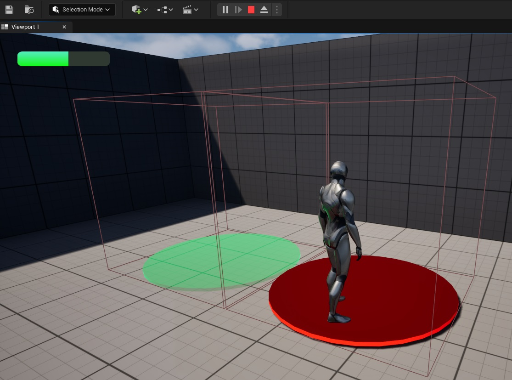

 
 - обработка смерти 
 

    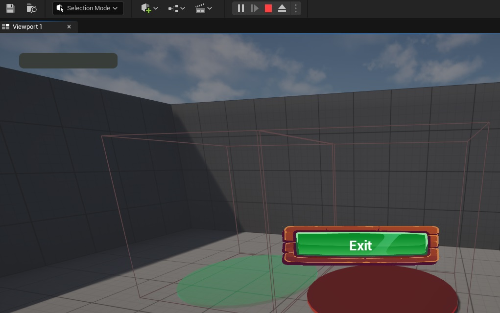

 

  
**Как сделано**:

1) В Level «ThirdPersonMap» добавлено
    - обработка события OnDeathMainCharacter

2) WBP_HUD:
    -  при инициализации сохраняет ссылку на HealthComponent для WBP_HealthBar

3) WBP_HealthBar:
    -  использует HealthComponentRef, чтобы обновлять состояние HealthPercentage

4) BP_ThirdPersonCharacter:
    - обрабатывает состояние смерти    

5) AC_HealthComponent:
    - обрабатывает урон в функции ProcessDamage, вызвает функцию UpdateHealth, уведомляет BP_ThirdPersonCharacter о смерти через "Call On Zero Health"
    - обновляет здоровье в функции UpdateHealth, уведомлеяет WBP_HealthBar через "Call On Health Updated"

6) BP_DamageZone и BP_HealZone
    - устроены одинаковы, но разные названия переменных
    - проверяет пересечение с BP_ThirdPersonCharacter
    - наносит урон всем, кто находится в зоне

Задание 8. Locomotion

**Что сделано**:
 - движение (простое, с ускорением)
 

    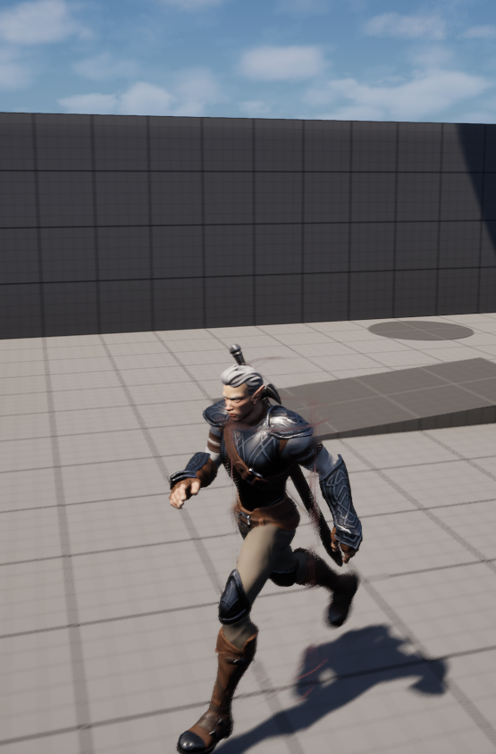

 - прыжок\падение
 
    
     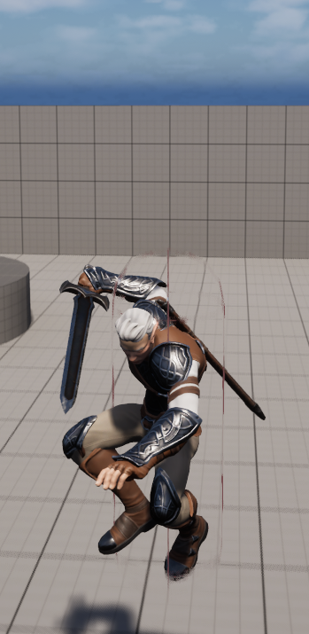

 - простая атака, смена стойки
 

     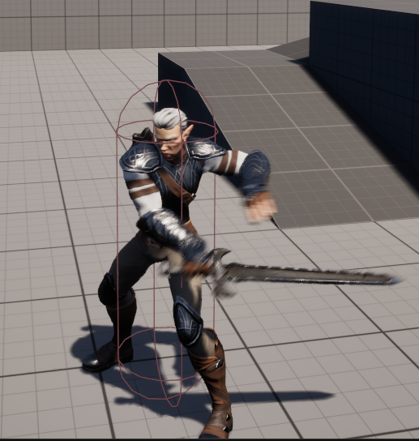

  
**Как сделано**:

1) Создание персонажа 
    - за основу взят персонаж <a href="https://www.fab.com/listings/53b68688-f8c0-4bc3-8612-7dce8df63b87">Elf Arden</a>
    - из оригинального пака взяты текстуры, материалы, анимации, скелет, physic asset
    - BP создан с нуля. <a href="https://www.fab.com/listings/53b68688-f8c0-4bc3-8612-7dce8df63b87">Оригинал</a> использовался в качестве образца. Некоторые настройки остались стандартными для UE (Nav Movement Properties, NavArea, Nav Agent, Rotation, Rotation Yaw)

2) Input
    - добавлен IMC_Default, IMC_Fight
    - добавлены Input Actions: 
        - IA_JumpDefault, 
        - IA_LookDefault, 
        - IA_MoveDefault(Движение\Бег в разные стороны),
        - IA_SlowWalk(Ходьба), 
        - IA_SprintDefault (бег с ускорением),
        - IA_ChangeFightingStance (смена стойки),
        - IA_Attack (простая атака)

    - управление через клавиатуру\мышь или контроллер

3) BP_MainCharacter
    - подключен интерфейс IMovableCharacter
    - подключен AC_MoveComponent
    - подключен AC_FightComponent
    - включено "Orient Rotation to Movement" для поворотов
    - используется PlayMontage для анимации простой атаки, экипировки оружия и разоружения.

4) AC_MoveComponent
    - компонент сохраняет ссылки на Character через интерфейс IMovableCharacter 
    - подключен IMC_Default (для движения)
    - движение w\a\s\d, прыжок и движение камеры сделаны по аналогии с ThirdPersonCharacter
    - ускорение включается по кнопке Shift
    - переключение ходьба\бег по кнопке Z

5) AC_FightComponent
    - компонент сохраняет ссылки на Character по аналогии с AC_MoveComponent
    - подключен IMC_Fight (для сражений)
    - клавиша C — смена стойки
    - первый клик по ЛКМ — экипировка оружия
    - повторный клик по ЛКМ — простая атака
    - переключение между стойками через Enum E_CharactersStance  

6) Анимация. ABP_MainCharacter
    - добавлена State Machine, которая использует Blend Space в зависимости от стойки (обычная, кулачный бой, с мечом).
    - падение, прыжок, приземление организованы по аналогии с ThirdPersonCharacter, но адаптированы и сделаны с нуля
    - прыжок и падение зависят от вида стойки (см. state machine "Main States")
    - используются слоты, Layered blend per bone и Blend Mask для смешивания анимаций во время действий (прыжок, сражение, экипировка оружия, разоружения) в разных стойках
    - стандартные анимации персонажа <a href="https://www.fab.com/listings/53b68688-f8c0-4bc3-8612-7dce8df63b87">Elf Arden</a> в директории "MyContent\External\Characters\ElfArden"
    - измененные anim. sequences, montages и blend spaces в директории "MyContent\Game\Characters\MainCharacter\Animations"

7) Анимация. BS_NeutralMovement, BS_FistCombatMovement, BS_ArmedMovement
    - содержат анимации (Idle, Walk, Run) в зависимоти от скорости и стойки
    - оригинальный <a href="https://www.fab.com/listings/53b68688-f8c0-4bc3-8612-7dce8df63b87">персонаж</a> не имеет анимаций движений влево\вправо\назад, поэтому в настройках BP_MainCharacter используются "Use Controller Rotation Yaw"(false) и "Orient Rotation to Movement"(true) 

Задание 6. Level Sequence и материалы

  
**Что и как сделано**:

1) Пролёт по карте
    - записан Level Sequence (/All/Game/MyContent/Sequence/LS_Start)
    - за основу взято окружение <a href="https://www.fab.com/listings/c4e83f22-369a-4f5c-8f86-d53ccd716ae6"> Dreamscape: Stylized Environment Tower </a> 

2) Изучена работа с материалами
    - изменен Master Material (/All/Game/MyContent/External/Stylized_Chests/Material/BaseMaterial/M_Master) из асета <a href="https://www.fab.com/listings/e0c2a1eb-d819-4c55-a58e-66691c0b4f5e">Stylized Chests Pack</a>,  который планируется использовать в игре.
    - изменен стандартный Material Instans (/All/Game/MyContent/Game/Materials/MI_Chest8_my_brown)

Задание 7. Система разрушений

**Что сделано**:
 - Добавлены несколько разрушемых объектов
 

    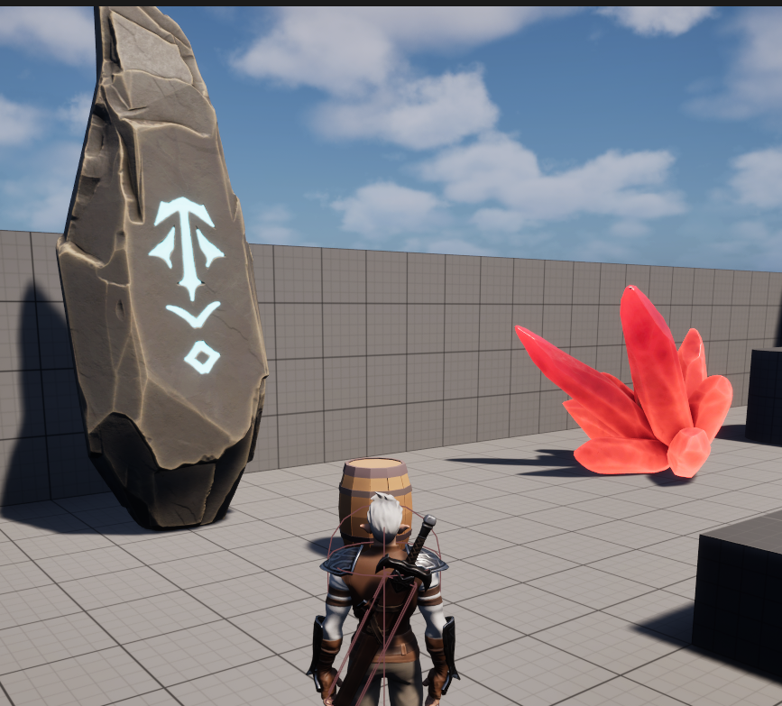    

 

    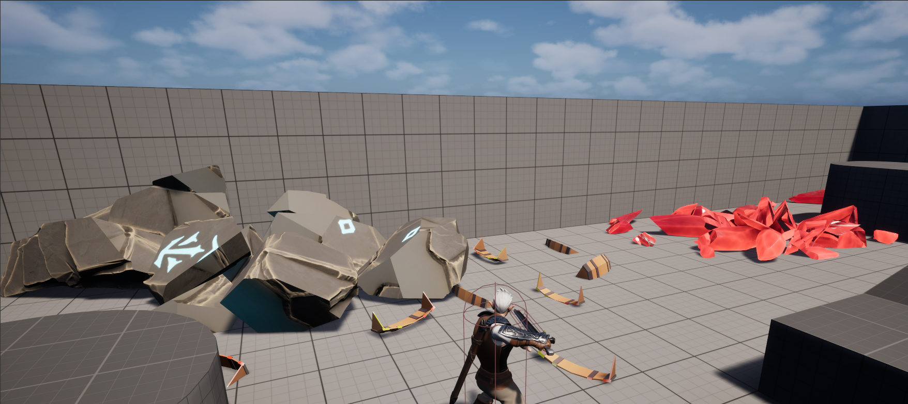

  
**Как сделано**:

1) BP_sword
    - добавлен "SpawnActor FS Master Field Sword"
    - Master Field создаёт при пересечении мечом другого объекта

2) Для камня и кристалла использован Uniform Fracture. Для бочки — Radial. 

Задание 9. Инвентарь 

**Что сделано**:
 - Взаимодействие с объектами в мире
    

        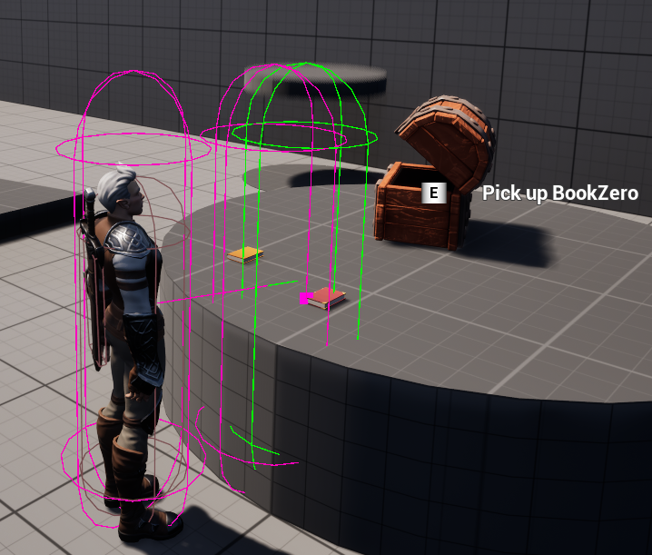
    

 - Инвентарь.  
    

    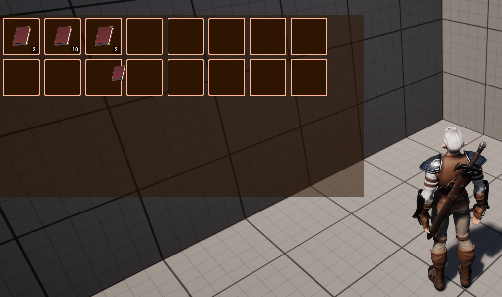
    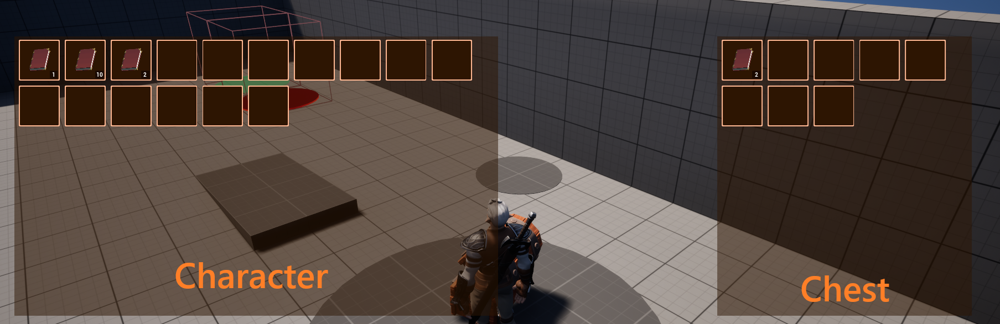
    

  
**Как сделано**:

1) Взаимодействие: 
    - E — клавиша взаимодействия
    - Добавлен Trace Channel "Interactive" (в настройках проекта)
    - добавлен IMC_InteractionContext
    - AC_InteractionComponent — каждый тик отслеживает, на какие интерактивные объекты (Trace Channel "Interactive") смотрит персонаж (./MyContent/Game/Blueprints/Components)
    - AC_InteractItemComponent — помогает связать BP_предмета с таблицей предметов ItemData через BP-настройки и реализует интерфейс взаимодействия с предметом (I_InteractInterface)
    - I_InteractInterface — требует реализовать методы "взаимодействие с объектом", "что происходит при взгляде на объект" (./MyContent/Game/Inventory)
    - ItemData — таблица для списка всех предметов (./MyContent/Game/Inventory)
    - S_ItemStruct — столбцы для таблицы предметов (./MyContent/Game/Inventory)
    - WBP_InteractionPrompt — подсказки "что сделать с предметом в мире" и "какую кнопку нажать"
    - Добавлен enum E_ItemType. Тип предмета влияет на взаимодействие с ним (при помощь AC_InteractItemComponent).
2) Инвентарь
    - I - клавиша для открытия инвентаря
    - S_SlotStruct — структура отдельного слота: ID предмета из таблицы ItemData и кол-во предметов
    - AC_InventoryComponent — инвентарь, которым может владеть персонаж; при добавлении предметов внутрь инвентаря (Content) указываются ID предмета из таблицы ItemData и кол-во (./MyContent/Game/Blueprints/Components)
    - HUD перенесён в BP_PlayerControllerMovableCharacter для передачи по ссылке в компоненты и виджеты
    - WBP_InventorySlot — виджет отдельной ячейки инвентаря
    - WBP_InventoryGrid — виджет сетки ячеек инвентаря
    - WBP_DragPreview, BP_DragDropInventory — иконка при перетаскивании предмета в инвентаре
    - WBP_PlayerMenu —  для запуска доп. окон на экране
    - WBP_ContainerInventory — для отображения инвентаря предмета и персонажа одновременно
    - WBP_ActionMenu — контекстное меню инвентаря (действия: Выбросить всё, выбросить один, использовать)

Задание 11. SFX 

**Что сделано**:
 - Добавлен звуки
    - воды рядом с рекой
    - шагов
    - леса\природы
    - вступительный проигрыш

  
**Как сделано**:

1) Ивенты шагов генерируются в анимации и воспроизводятся через ABP_MainCharacter
2) Вода: 
    - на сцене размещен звук, ограниченный по дальности. Используется Attenuation Settings. 
3) Музыка при запуске игры — через Level BP вместе с Sequence
4) Звуки окружения — появляются после Sequence

